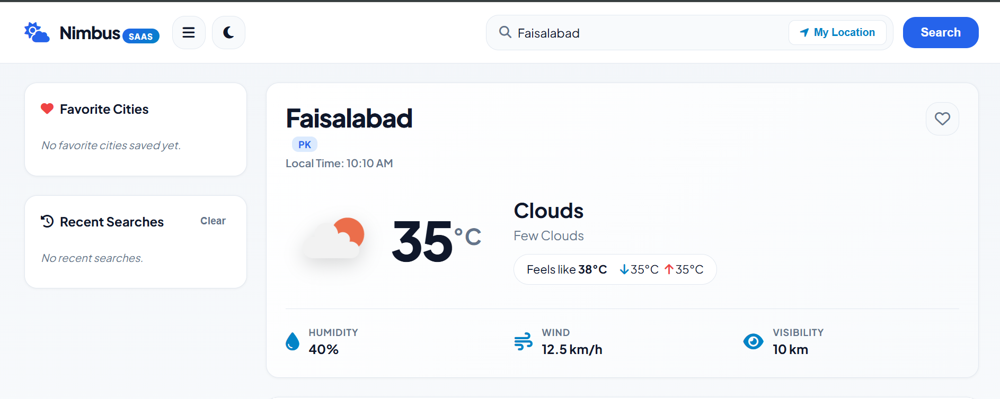
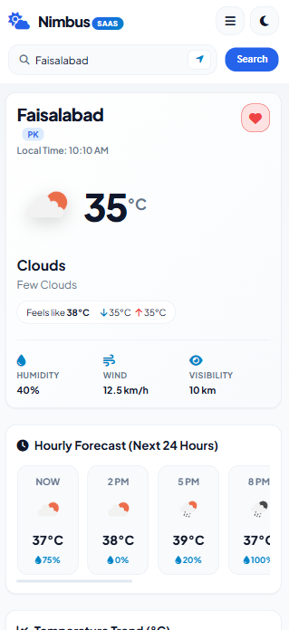

# Nimbus — Weather Dashboard

Nimbus is a production-oriented, full-stack weather dashboard built with **Python 3.12+**, **Flask**, **OpenWeatherMap API**, **SQLite**, **Vanilla JavaScript (ES6+)**, and **Chart.js**. It provides real-time current weather metrics, hourly temperature visualization charts, 5-day daily forecasts, browser geolocation lookup, and interactive favorites and search history management. Designed with a SaaS-inspired UI design system, it features configurable in-memory API caching, Flask-Limiter rate protection, theme toggling, and adaptive weather condition backgrounds.

- Live Demo: https://weather-dashboard-roan-sigma.vercel.app/
- GitHub Repository: https://github.com/muhmdhxsn-dev/weather-dashboard

---

## 📸 Screenshots

Nimbus is fully responsive across desktop, tablet, and mobile devices, providing a seamless user experience on any screen size.

### Desktop Dashboard


### Mobile Responsive Dashboard


---

## 🌟 Features

### 🌤️ Weather Data & Metrics
* **Current Weather**: Real-time temperature, condition, detailed description, feels-like temperature, daily minimum/maximum temperatures, atmospheric humidity, wind speed & direction angle, barometric sea-level pressure, visibility distance, cloud coverage percentage, and formatted local sunrise/sunset schedules.
* **Hourly Forecast (Next 24 Hours)**: 8 sequential 3-hour forecast slots detailing hourly temperatures and precipitation probabilities (`pop`).
* **5-Day Daily Forecast**: Aggregated daily breakdown displaying high/low temperature ranges, condition icons, average humidity, and maximum daily precipitation probability.
* **Interactive Temperature Chart**: Smooth line chart powered by **Chart.js** displaying hourly temperature trends with theme-adaptive colors and hover tooltips.

### 📍 Location & Personalization
* **City Search**: Instant weather retrieval by city name.
* **Browser Geolocation**: One-click weather lookup using device latitude and longitude coordinates via the HTML5 Geolocation API.
* **Favorite Cities**: Save frequently monitored cities to a quick-access favorites list stored via SQLite.
* **Search History**: Automatic logging of recent city searches with quick-revisit clicking and full history clearing capability.
* **Dark / Light Theme Engine**: Toggleable theme switcher with persistent user preference stored in `localStorage` and dynamic canvas chart color re-rendering.
* **Dynamic Weather Backgrounds**: Adaptive visual accents matching real-time weather conditions (Clear Day, Clear Night, Clouds, Rain, Thunderstorm, Snow).

### 📱 Responsive Design
* **Desktop Layout**: Dual-column dashboard grid featuring a sticky navigation header, dedicated sidebar panel, hero weather card, hourly timeline strip, chart section, parameters grid, and 5-day forecast cards.
* **Tablet Layout**: Stacked single-column fluid layout with responsive widget grids.
* **Mobile Layout**: Compact mobile layout with touch-friendly controls, responsive font scaling, and skeleton loading states.
* **Mobile Navigation Drawer**: Toggleable mobile menu button (`#mobile-menu-btn`) that opens search history and saved favorites in a seamless slide-down drawer without disrupting main screen content.
* **Zero Horizontal Overflow**: Built with strict layout constraints (`overflow-x: clip`), ensuring smooth scrolling across screen sizes from 320px up to 4K displays.

### ⚡ Performance, Reliability & Security
* **In-Memory API Caching**: Thread-safe server-side cache that stores raw OpenWeatherMap API responses to minimize external quota consumption and reduce response latency.
* **Configurable Cache TTL**: Custom cache expiration set via environment variable (`WEATHER_CACHE_TTL`, defaulting to `600` seconds / 10 minutes).
* **City Name Cache Normalization**: Case-insensitive key normalization (e.g., searches for `Lahore`, `lahore`, and `LAHORE` all resolve to `weather:city:lahore`).
* **Coordinate Cache Normalization**: Geographic coordinates are rounded to 4 decimal places (`weather:coords:31.5204:74.3587`), preventing duplicate external API queries for slight GPS jitter.
* **Flask-Limiter Rate Limiting**: Built-in request rate protection limiting client IPs to **60 requests per minute** on weather and forecast endpoints.
* **Graceful HTTP 429 Handling**: Exceeded rate limit requests return structured JSON `HTTP 429 Too Many Requests` responses with user-friendly alert banner notifications on the frontend.
* **Frontend Error Resilience**: Built-in notifications for invalid city input, network timeouts, API key configuration errors, and location permission denials.

---

## 🛠️ Tech Stack

| Technology | Purpose |
|---|---|
| **Python 3.12+** | Core backend application language |
| **Flask 3.0+** | Lightweight Web Framework and REST API routing |
| **OpenWeatherMap API** | External weather data provider (Current & 5-Day/3-Hour endpoints) |
| **SQLite** | Database engine for search history and favorite cities (stored locally or in serverless `/tmp`) |
| **Requests** | Synchronous HTTP client for external API requests |
| **python-dotenv** | Local environment variable management (`.env`) |
| **Flask-Limiter** | Client IP rate limiting protection |
| **HTML5** | Semantic web page structure and accessible markup |
| **CSS3** | Vanilla design system using CSS custom properties, flexbox, CSS grid, and dark mode tokens |
| **Vanilla JavaScript (ES6+)** | Dynamic DOM rendering, fetch API calls, geolocation, theme management, and event handling |
| **Chart.js 4.4+** | Interactive hourly temperature line chart visualization |
| **Pytest 8.0+** | Automated unit and integration testing suite |
| **Vercel** | Serverless cloud deployment platform |

---

## 📡 API Endpoints

The Flask backend exposes the following RESTful API endpoints:

| Method | Endpoint | Description | Rate Limit |
|---|---|---|---|
| `GET` | `/` | Renders main Weather Dashboard web application | None |
| `GET` | `/api/health` | Health check endpoint verifying backend and API key status | None |
| `GET` | `/api/weather` | Current weather metrics by city name (`?city=Lahore`) | 60 / min |
| `GET` | `/api/forecast` | Hourly and 5-day forecast by city name (`?city=Lahore`) | 60 / min |
| `GET` | `/api/weather/location` | Current weather metrics by coordinates (`?lat=31.5204&lon=74.3587`) | 60 / min |
| `GET` | `/api/forecast/location` | Hourly and 5-day forecast by coordinates (`?lat=31.5204&lon=74.3587`) | 60 / min |
| `GET` | `/api/history` | Retrieves recent search history items (up to 8) | None |
| `DELETE` | `/api/history` | Clears all search history records | None |
| `GET` | `/api/favorites` | Retrieves list of saved favorite cities | None |
| `POST` | `/api/favorites` | Adds a new favorite city (`JSON payload: {"city": "...", "country": "..."}`) | None |
| `DELETE` | `/api/favorites` | Removes a favorite city by name (`?city=...`) or ID (`?id=...`) | None |
| `DELETE` | `/api/favorites/<fav_id>` | Removes a favorite city by database ID | None |

---

## 🚀 Installation & Local Setup

### 1. Clone & Navigate
```bash
git clone https://github.com/muhmdhxsn-dev/weather-dashboard.git
cd weather-dashboard
```

### 2. Create & Activate Virtual Environment

**Windows PowerShell:**
```powershell
python -m venv .venv
.\.venv\Scripts\Activate.ps1
```

**Windows CMD:**
```cmd
python -m venv .venv
.\.venv\Scripts\activate.bat
```

**Linux / macOS:**
```bash
python3 -m venv .venv
source .venv/bin/activate
```

### 3. Install Dependencies
```bash
pip install -r requirements.txt
```

### 4. Configure Environment Variables
Create a local `.env` file in the project root directory from `.env.example`:

**Windows:**
```cmd
copy .env.example .env
```

**Linux / macOS:**
```bash
cp .env.example .env
```

Open `.env` and set your API credentials:
```env
WEATHER_API_KEY=your_actual_openweathermap_api_key
SECRET_KEY=your_secure_random_secret_key
FLASK_ENV=development
WEATHER_CACHE_TTL=600
```

> [!IMPORTANT]
> The `.env` file contains sensitive API keys and secrets. It **MUST NOT** be committed to public version control and is listed in `.gitignore`.

### 5. Run the Application
```bash
python app.py
```
Open your browser at `http://127.0.0.1:5000`.

---

## ☁️ SQLite & Serverless Deployment Note

* **Local Environment**: SQLite stores user search history and favorite cities permanently in `database/weather.db`.
* **Vercel Serverless Deployment**: In a serverless environment (such as Vercel), the application detects the execution context and sets the database location to `/tmp/database/weather.db`. Because serverless execution containers on Vercel are ephemeral, files written to `/tmp` are temporary and reset during container recycling and cold starts. SQLite storage on Vercel is intended for temporary runtime storage rather than persistent data storage.

---

## 📁 Architecture & Project Structure

```text
Weather App/
├── app.py                  # Flask application routes, error handlers, and rate limiting
├── database/
│   └── db.py               # SQLite connection management, schema initialization, and CRUD helpers
├── services/
│   ├── cache_service.py    # Thread-safe in-memory cache engine and key normalizers
│   └── weather_service.py  # OpenWeatherMap API fetchers, cache integration, and response parsers
├── static/
│   ├── css/
│   │   └── style.css       # Custom design system, CSS grid/flexbox, theme tokens, and media queries
│   └── js/
│       └── app.js          # Dynamic UI controller, Chart.js graph integration, theme, and API client
├── templates/
│   └── index.html          # Main HTML5 dashboard layout template
├── tests/
│   └── test_app.py         # Pytest test suite covering endpoints, caching, rate limiting, and DB
├── requirements.txt        # Python package dependencies
├── .env.example            # Environment variables configuration template
├── .gitignore              # Git ignore rules (ignores .env, .venv, __pycache__, SQLite DBs)
├── README.md               # Application documentation
└── vercel.json             # Vercel serverless deployment routing configuration
```

---

## 🔬 Running Automated Tests

The repository includes a automated test suite built with **Pytest** and `unittest.mock`.

To run all tests:
```bash
pytest
```

### Verified Test Scenarios Covered:
* Homepage (`/`) and Health check (`/api/health`) rendering.
* Weather response payload normalization for current weather and forecast endpoints.
* Cache miss (API fetch) vs. Cache hit (retrieved from memory).
* Case normalization caching (`Lahore`, `lahore`, `LAHORE` share single cache entry).
* Cache isolation between different city queries.
* Coordinate caching normalization (`31.520411, 74.358711` rounds to 4 decimal places).
* Cache expiration timing based on TTL.
* Rate limit enforcement (HTTP 429 response on exceeding 60 requests/minute).
* SQLite search history and favorite cities database CRUD operations.

---

## 🔮 Future Improvements

- **Hosted Relational Database**: Migration to PostgreSQL / Supabase for persistent serverless storage of favorites and search history.
- **Distributed Caching**: Integration of Redis for shared cache persistence across multi-instance serverless deployments.
- **User Accounts & Auth**: Adding user sign-in and personalized settings sync across devices.
- **Severe Weather Alerts**: Incorporating push notifications and official weather advisory banners.

